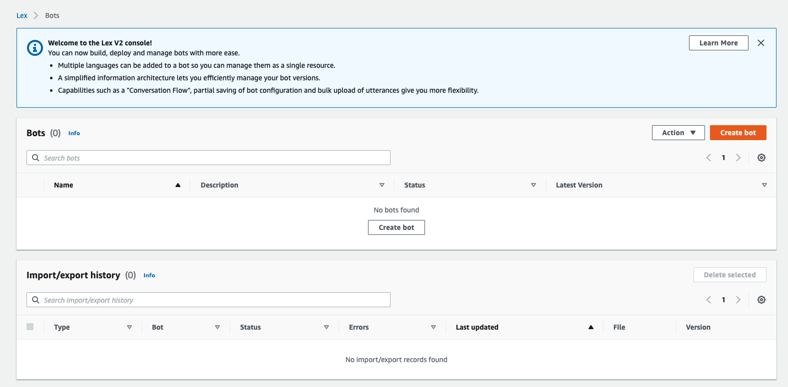

# Improve customer experience with Intelligent Chatbots

- [Overview](#L9)
- [Creating an Amazon Kendra index](#L18)
- [Adding your FAQ content](#L40)
- [Creating your Lex Bot](#L76)
- [Conclusion](#L142)

## Overview

Amazon Lex is a service for building conversational interfaces into any application using voice and text. Amazon Kendra is an intelligent search service powered by machine learning. In this builder session, you will learn how you can integrate an Amazon Lex bot with Amazon Kendra using a search intent, so you can quickly build a bot to provide answers in a conversation as illustrated below

In this tutorial, you will assume the role of a chatbot developer. You have been asked to develop a chatbot that can make dental appointments and provide answers to FAQ regarding the appointment.

## Creating an Amazon Kendra index

1. In the AWS Management Console, search services and choose **Amazon Kendra**.

2. On the Amazon Kendra console, choose **Create an index**. 
   For Index name, enter a name, such as `Dental-clinic-faq`. 
   
   For Description, enter an optional description, such as `Dental Clinic FAQs`.

   For IAM role, choose **Create a new role** to create a role to allow Amazon Kendra to access Amazon CloudWatch Logs. For Role name, enter a name, such as `cloudwatch-logs`. Kendra will prefix the name with AmazonKendra and the AWS region.

   Click **Next**.

   

3. For Access control settings, leave **No** as it is, and click **Next**

4. For Provisioning editions, choose **Developer edition** and click **Create**

   

## Adding your FAQ content

While Amazon Kendra creates your new index, upload your content to an Amazon Simple Storage Service (Amazon S3) bucket.

1. On the Amazon S3 console, click **Create bucket** to create a new bucket, put a bucket name such as `kendra-dental-clinic-docs-<your-account#>`.

   Keep the default settings and click **Create bucket**.

2. Download the following sample files and upload them to your new S3 bucket:

    [dental-clinic-faq.csv](./files/dental-clinic-faq.csv)

When the Kendra index creation is complete, you can add your FAQ content following below steps.

3. On the Amazon Kendra console, click your index, then click **Add FAQs**.

4. In Define FAQ project, for FAQ name, enter a name, such as `dental-clinic-faq`. 

   For Description, enter an optional description, such as `FAQ for Dental Clinic appointments`.

   In FAQ settings, for FAQ file format, choose **.csv file - Basic**. 
   
   For S3, browse Amazon S3 to find your bucket, and choose **dental-clinic-faq.csv**. 
   
   For IAM role, choose **Create a new role** to allow Amazon Kendra to access your S3 bucket. For Role name, enter a name, such as `s3-access`. Kendra will prefix your role name with AmazonKendra-.

   Click **Add**, and stay on the page while Amazon Kendra creates your FAQ.

After you create your FAQs, you can try some Kendra searches by choosing Search console. For example:

- Where is the dental clinic?
- What time does the clinic open?
- how long does it take to do teeth cleanings?

## Creating a Lex Bot

1. In the AWS Management Console, search services and choose **Amazon Lex**
   Make sure you are in v2 of the Lex Console (The heading should say "Welcome to the Lex Console" as shown below)
   Choose **Create Bot**

   

2. In Bot configuration, choose **Start with an example** and then select **MakeAppointment** from the example bot drop down list 
   
   
  
   
   Add a name for the Bot such as `dentist-appt-bot` and add a description, such as `chatbot for dentist appointments and FAQ`. 
   For IAM Role, choose **create a new role**.  
   Set COPPA to **No** and leave the default timeout setting as 5 minutes.
   
   

   Click **Next.**

3. Leave Select language as **English (US)**. 
   
   Change Voice Interaction to **None**. This is a text based application.

   

   Click **Done** - You should see a message indicating successful creation of bot as shown below

   

5. Now, we will add another intent to use Kendra search. 
   
   Click **Add Intent** on the top right side of the screen and select **Built-In Intents**. 
   
   From the drop down list choose **AMAZON.KendraSearchIntent**. 
   
   Give the intent a descriptive name, such as `AgentAssistSearchIntent`. 
   
   Choose the Kendra Index (e.g., Dental-clinic-faq) you created earlier from the drop down list in Amazon Kendra index. 
   
   Click **Add**

   

7. Under Closing responses, type the following for the message. This enables the response provided by Kendra to be provided back to the client       

   `((x-amz-lex:kendra-search-response-question_answer-answer-1))`

   

   Click **Save Intent** and then **Build** - After some time, the bot should be successfully built as indicated below

8. Click **Test** and then type in a question such as `Where is the dental clinic?`. The bot should respond with an answer as indicated below.

   

   Try asking other questions in the bot such as those posed to Kendra earlier. Try variations such as 'when will the clinic close' to see if the bot responds correctly

9.  Now lets say you want to have the bot respond to a welcome greeting. Try adding an intent that does this as shown in Step 5. You need to select **Add empty intent**. The bot should respond to standard greetings with a response such as Hi, how may i help you? as shown below

    

## OPTIONAL - Adding an S3 data source

Amazon Kendra can also index documents stored in various data repositories - from S3 storage to relational databases, shared drives, etc. In this exercise we will add a sample dataset (AWS documentation) to our Kendra index just to demonstrate this capability.

1. In Amazon Kendra console select the index you created earlier, and then choose Data sources on the left hand side.

2. Click "Add data source" and then choose the very first option - Sample AWS documentation 

   

3. On "Define attributes" screen name your data set (e.g. aws-docs) and click "Add data source"

   

4. Next, in the Lex console, open Kendra search intent which we added earlier ("Bot Versions"->"Draft version"->"English US"->"View Intents"->"Kendra search intent"->"Closing respoinses"->"Response sent to the user")

5. Currently, the response is set to x-amz-lex:kendra-search-response-question_answer-answer-1 which references FAQ. Let's replace it with a the following value:

   `((x-amz-lex:kendra-search-response-answer-1))`

   Then expand Variations and add the following line:

   `((x-amz-lex:kendra-search-response-document-1))`
   

6. Save the intent, build the bot and try testing Kendra's search of the indexed AWS documentation. 

Some questions to try:

`How many free tier hours are included with Kendra?`

`How do I SSH into my EC2 instance`?

`What is EBS?`

`Concurrent executions in Lambda per region`

## Conclusion 

In this session, you learned how to integrate Amazon Lex and Amazon Kendra using a search intent. Amazon Kendra can extract specific answers from unstructured data. No pre-training is required; you simply point Amazon Kendra at your content, and it provides specific answers to natural language queries.

## License

Copyright Amazon.com, Inc. or its affiliates. All Rights Reserved.

Permission is hereby granted, free of charge, to any person obtaining a copy of this
software and associated documentation files (the "Software"), to deal in the Software
without restriction, including without limitation the rights to use, copy, modify,
merge, publish, distribute, sublicense, and/or sell copies of the Software, and to
permit persons to whom the Software is furnished to do so.

THE SOFTWARE IS PROVIDED "AS IS", WITHOUT WARRANTY OF ANY KIND, EXPRESS OR IMPLIED,
INCLUDING BUT NOT LIMITED TO THE WARRANTIES OF MERCHANTABILITY, FITNESS FOR A
PARTICULAR PURPOSE AND NONINFRINGEMENT. IN NO EVENT SHALL THE AUTHORS OR COPYRIGHT
HOLDERS BE LIABLE FOR ANY CLAIM, DAMAGES OR OTHER LIABILITY, WHETHER IN AN ACTION
OF CONTRACT, TORT OR OTHERWISE, ARISING FROM, OUT OF OR IN CONNECTION WITH THE
SOFTWARE OR THE USE OR OTHER DEALINGS IN THE SOFTWARE.

